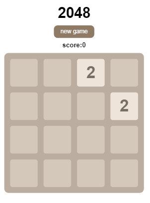
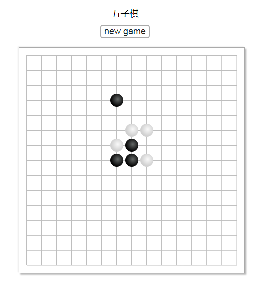

#SMALL DEMO
一些小项目

###2048游戏
展示地址 https://emloxe.github.io/small_demo/game2048/index.html
采用js控制div实现方块的移动，数组存储棋盘数据，数据改变重绘棋盘，实现了2048的基本功能
可适配手机端

###五子棋游戏
展示地址 https://emloxe.github.io/small_demo/gameGobang/index.html

###H5阅读器
运用JQuery，AJAX
一个项目的一部分，编写了视图模块
获取josn数据，展现在阅读器上，可以调整阅读器的背景颜色，字体大小，并缓存于local storage中，可以选择上下一章节。

###电影网站
根据scott课程搭建
简介
-----
**1. 项目后端搭建:**
  * 使用`NodeJs的express`框架完成电影网站后端搭建;
  * 使用`mongodb`完成数据存储,通过`mongoose`模块完成对`mongodb`数据的构建;
  * 使用`jade`模板引擎完成页面创建渲染;
  * 使用`Moment.js`格式化电影存储时间;

**2. 项目前端搭建:**
  * 使用`jQuery`和`Bootsrap`完成网站前端JS脚本和样式处理;
  * 前后端的数据请求交互通过`Ajax`完成;

